# USOL

**Universal System Optimization Layer** — um frontend colorido, com ícones e funcionalidades extras para o APT.

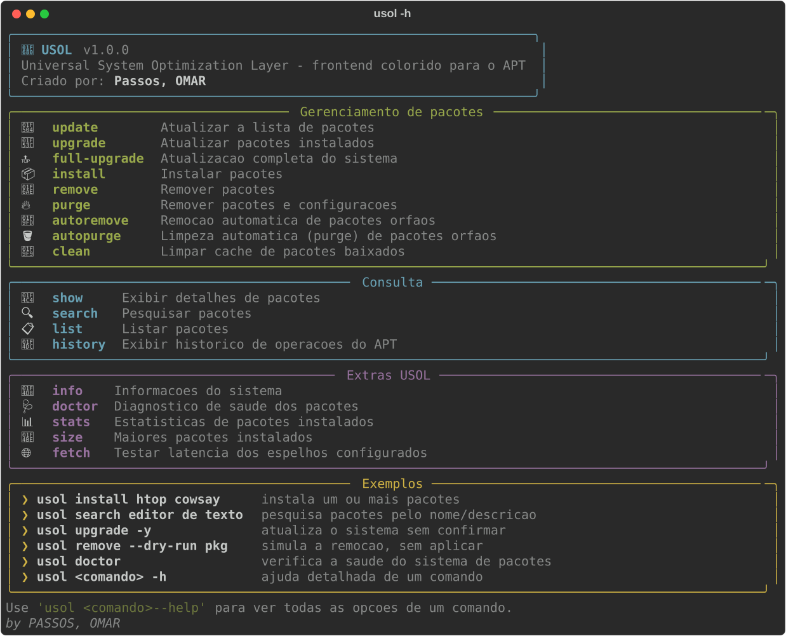
<p><em>Tela de ajuda do <code>usol -h</code>: todos os comandos organizados por categoria, com ícone e descrição.</em></p>

## Cansado do APT?

Se você está cansado de ficar decorando as flags do `apt`, olhando uma saída em preto e branco e sem entender direito o que vai ser instalado, removido ou atualizado — **passe a utilizar o USOL**. Mesma base (APT/dpkg), mesmo poder, mas com um visual muito mais atraente, tabelas organizadas, ícones para cada ação e comandos extras que o APT tradicional não tem.

## O que é o USOL

O USOL é um script em Python (usando a biblioteca [Rich](https://github.com/Textualize/rich)) que funciona como uma camada por cima do `apt-get`/`apt-cache`/`dpkg`. Ele traduz a saída crua do APT em painéis e tabelas coloridas, mostra exatamente o que vai acontecer antes de confirmar qualquer alteração, e adiciona comandos de diagnóstico e estatísticas que não existem no APT padrão.

## Para que serve

- Instalar, remover, purgar e atualizar pacotes com confirmação visual clara do que será feito antes de aplicar.
- Consultar detalhes, buscar e listar pacotes com destaque para o que já está instalado.
- Ver o histórico de operações do APT de forma legível.
- Diagnosticar a saúde do sistema de pacotes (`doctor`), ver estatísticas de espaço em disco (`stats`/`size`) e medir a latência dos espelhos configurados (`fetch`).
- Simular qualquer operação com `--dry-run` antes de aplicar de verdade.

## Para quais distribuições Linux funciona

Qualquer distribuição baseada em **Debian** que use **APT/dpkg** como gerenciador de pacotes, por exemplo:

- Debian
- Ubuntu (e derivadas: Linux Mint, Pop!_OS, Zorin OS, elementary OS, etc.)
- Kali Linux
- Parrot OS
- Raspberry Pi OS
- MX Linux

> Não funciona em distribuições que não usem APT (Fedora/RHEL com `dnf`, Arch com `pacman`, etc.).

## Requisitos

- Python 3.8+
- Biblioteca [`rich`](https://pypi.org/project/rich/)
- `apt`, `apt-get`, `apt-cache` e `dpkg` disponíveis no sistema

Instalando a dependência (caso ainda não tenha):

```bash
sudo apt install python3-rich
# ou
pip install --user rich
```

## Instalação

```bash
# 1. copie o projeto para a pasta de scripts
git clone <url-do-repositorio> ~/scripts/USOL
# ou apenas coloque o usol.py em ~/scripts/USOL/

# 2. deixe o script executável
chmod +x ~/scripts/USOL/usol.py

# 3. crie um atalho no PATH do usuário
ln -sf ~/scripts/USOL/usol.py ~/.local/bin/usol

# 4. pronto — use de qualquer lugar
usol -h
```

> `~/.local/bin` precisa estar no seu `PATH` (na maioria das distros modernas já vem configurado por padrão).

## Como usar

```bash
usol                     # mostra a tela de ajuda com todos os comandos
usol -h                  # idem, também aceita --help
usol <comando> -h        # ajuda detalhada de um comando específico
```

### Comandos

| Comando | O que faz |
|---|---|
| `usol update` | Atualiza a lista de pacotes |
| `usol upgrade` | Atualiza os pacotes instalados |
| `usol full-upgrade` | Atualização completa do sistema |
| `usol install <pkg...>` | Instala pacotes |
| `usol remove <pkg...>` | Remove pacotes |
| `usol purge <pkg...>` | Remove pacotes e suas configurações |
| `usol autoremove` | Remoção automática de pacotes órfãos |
| `usol autopurge` | Limpeza automática (purge) de pacotes órfãos |
| `usol clean` | Limpa o cache de pacotes baixados |
| `usol show <pkg...>` | Exibe detalhes de um pacote |
| `usol search <termo>` | Pesquisa pacotes pelo nome/descrição |
| `usol list` | Lista pacotes instalados ou atualizáveis (`--upgradable`) |
| `usol history` | Exibe o histórico de operações do APT |
| `usol info` | Informações do sistema *(extra)* |
| `usol doctor` | Diagnóstico de saúde dos pacotes *(extra)* |
| `usol stats` | Estatísticas de pacotes instalados *(extra)* |
| `usol size` | Ranking dos maiores pacotes instalados *(extra)* |
| `usol fetch` | Testa a latência dos espelhos configurados *(extra)* |

Praticamente todos os comandos que alteram o sistema aceitam:

- `-y` / `--yes` — não pede confirmação
- `--dry-run` — simula a operação e mostra a tabela do que aconteceria, sem aplicar nada

### Exemplos

```bash
usol install htop cowsay        # instala um ou mais pacotes
usol remove --dry-run pacote    # simula a remoção, sem aplicar
usol search editor de texto     # pesquisa pacotes pelo nome/descrição
usol upgrade -y                 # atualiza o sistema sem confirmar
usol doctor                     # verifica a saúde do sistema de pacotes
```

## Screenshots

Uma captura de cada comando do USOL, com uma breve explicação do que ele faz.

<details open>
<summary><strong>Gerenciamento de pacotes</strong> (update, upgrade, install, remove...)</summary>

**`usol update`** — atualiza a lista de pacotes disponíveis nos repositórios configurados (equivalente ao `apt update`).


**`usol upgrade --dry-run`** — simula a atualização dos pacotes instalados e mostra o que seria feito, sem aplicar nada.


**`usol full-upgrade --dry-run`** — simula uma atualização completa do sistema (equivalente ao `apt full-upgrade`), inclusive quando é preciso instalar ou remover dependências.


**`usol install cowsay --dry-run`** — mostra a tabela de simulação antes de instalar: pacote, versão e o que vai acontecer, sem alterar o sistema.
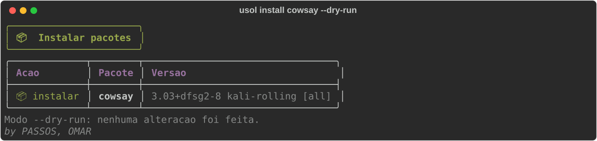

**`usol remove htop --dry-run`** — simula a remoção de um pacote, mantendo os arquivos de configuração.
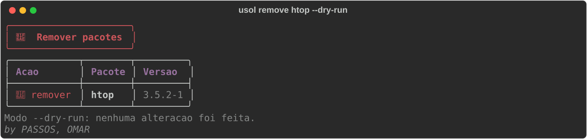

**`usol purge htop --dry-run`** — simula a remoção completa de um pacote, incluindo seus arquivos de configuração.
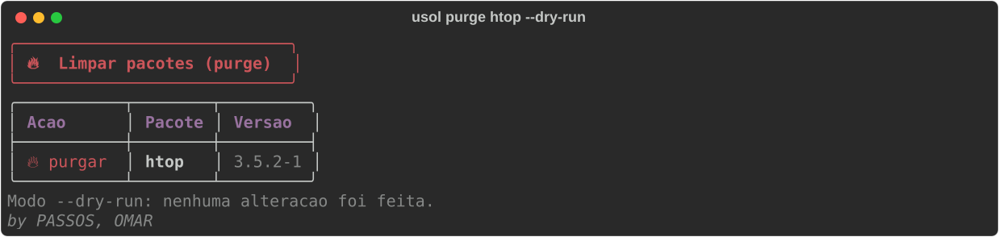

**`usol autoremove --dry-run`** — simula a limpeza de pacotes instalados automaticamente como dependência e que não são mais necessários.
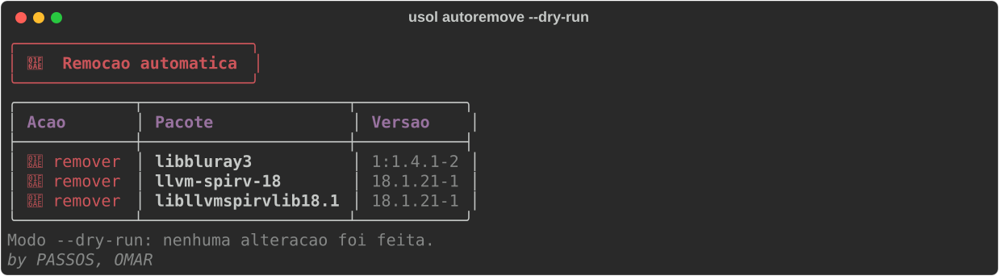

**`usol autopurge --dry-run`** — mesma limpeza automática do `autoremove`, mas também purga as configurações dos pacotes órfãos.
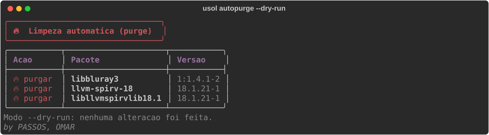

**`usol clean`** — limpa o cache local de pacotes `.deb` já baixados, liberando espaço em disco.


</details>

<details open>
<summary><strong>Consulta</strong> (show, search, list, history)</summary>

**`usol show curl`** — exibe os detalhes completos de um pacote (versão, dependências, descrição, tamanho), com os campos destacados em cores.
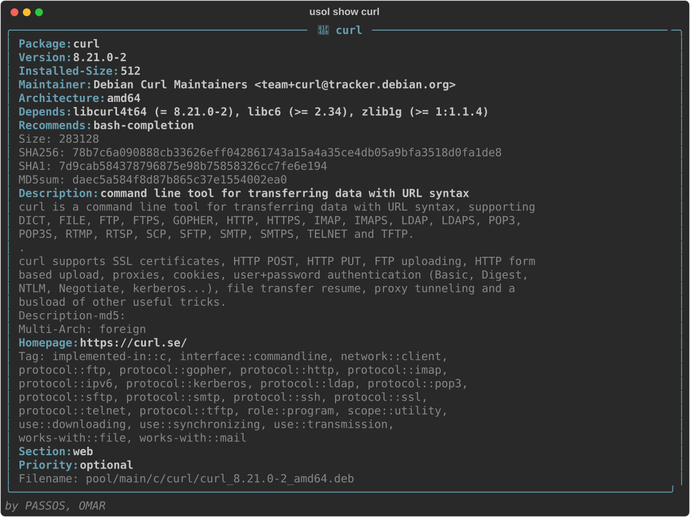

**`usol search curl`** — pesquisa pacotes pelo nome ou descrição, marcando com ● os que já estão instalados.
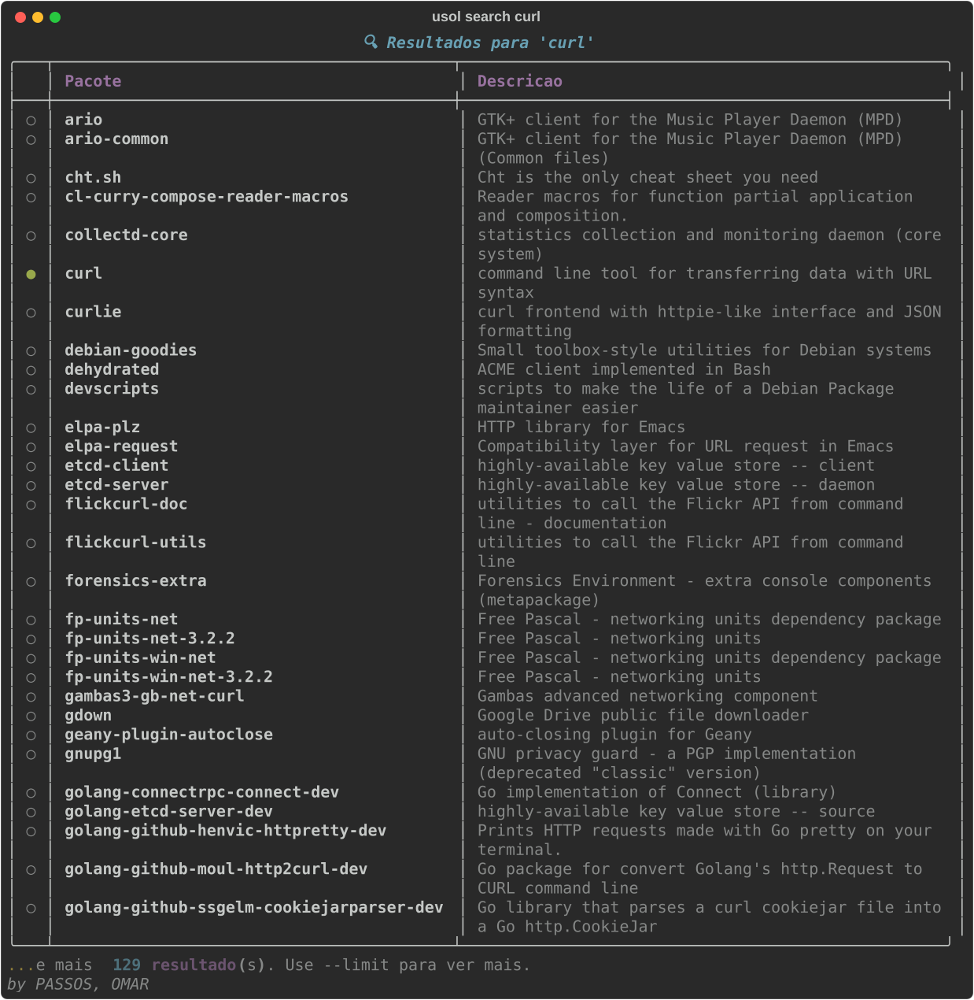

**`usol list --upgradable`** — lista todos os pacotes que têm uma atualização disponível.
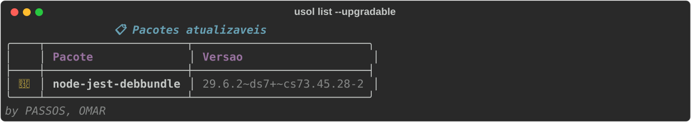

**`usol history --limit 6`** — mostra o histórico de operações do APT (instalações, remoções, atualizações) de forma legível, com data e comando executado.
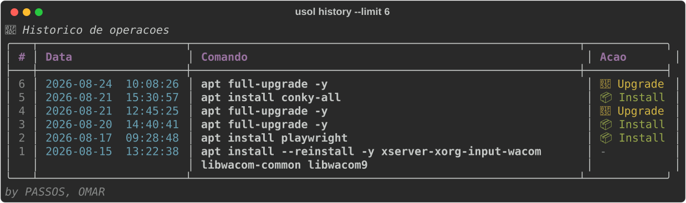

</details>

<details open>
<summary><strong>Extras USOL</strong> (info, doctor, stats, size, fetch)</summary>

**`usol info`** — painel com informações do sistema: distribuição, kernel, uptime, quantidade de pacotes instalados/atualizáveis e tamanho do cache do APT.
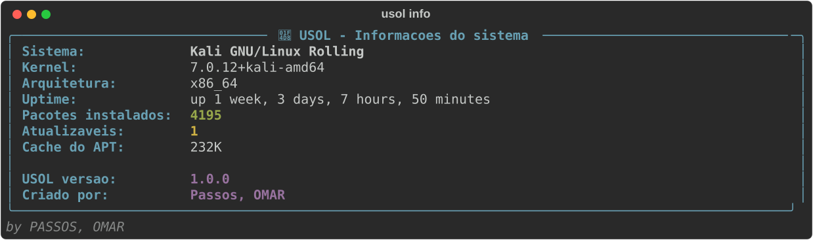

**`usol doctor`** — diagnóstico rápido de saúde do sistema de pacotes: pacotes quebrados, inconsistência de dependências, pacotes retidos e órfãos.
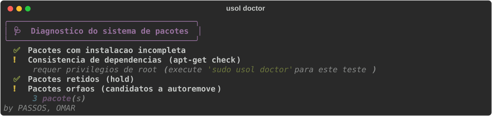

**`usol stats`** — estatísticas gerais dos pacotes instalados, incluindo um ranking visual dos maiores em espaço ocupado.
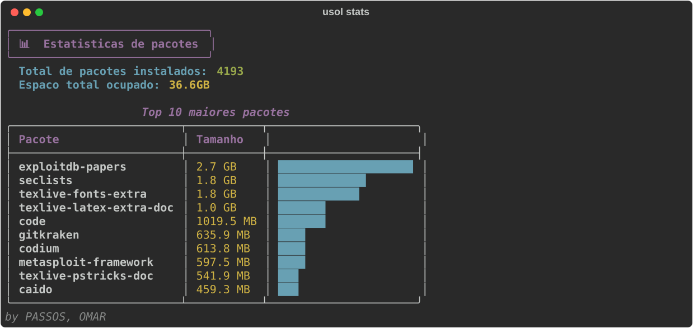

**`usol size --top 8`** — lista os pacotes que mais ocupam espaço em disco, do maior para o menor.
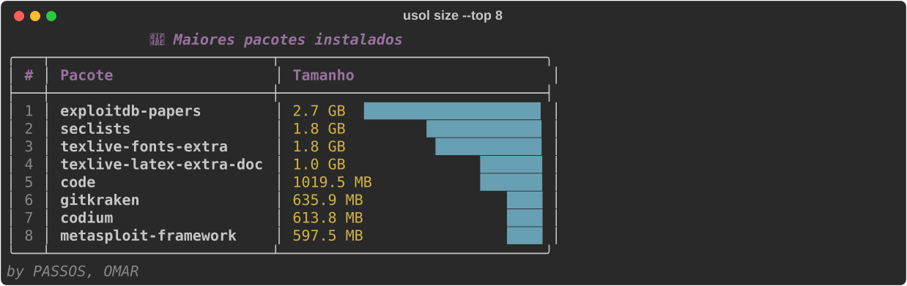

**`usol fetch`** — mede a latência de resposta de cada espelho (mirror) configurado no `sources.list` e ranqueia por velocidade.
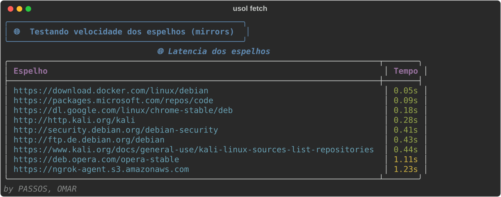

</details>

> As capturas de `update` e `clean` mostram apenas o banner inicial: ambos exigem `sudo` e o restante da saída é a própria saída nativa do `apt-get`.

## Criador

USOL foi criado por **Passos, OMAR**.

---

*by PASSOS, OMAR*
